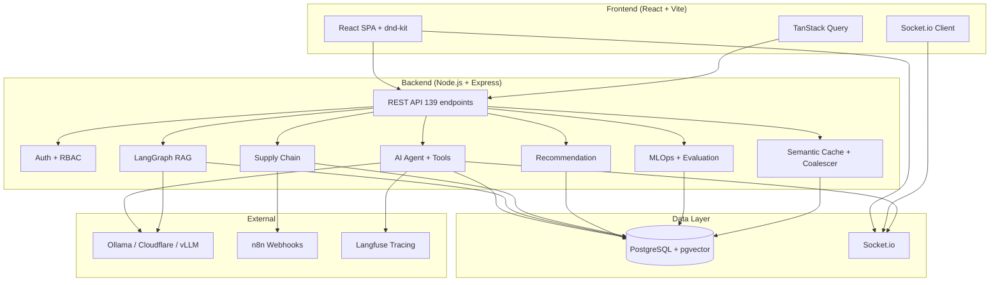
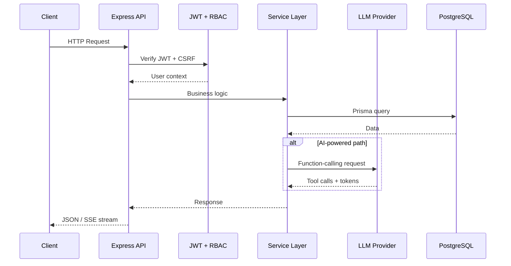
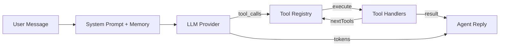
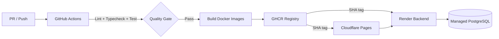

# TaskFlow

<div align="center">

[](https://github.com/imtarget05/TaskFlow/actions/workflows/ci-cd.yml)
[](https://github.com/imtarget05/TaskFlow)
[](https://github.com/imtarget05/TaskFlow)
[](https://github.com/imtarget05/TaskFlow)
[](https://taskflow-server-n9a7.onrender.com)

**Real-time collaborative Kanban with AI agent, RAG research, and supply chain automation**

[Live Demo](https://taskflow-server-n9a7.onrender.com) · [API Docs](#api-examples) · [Architecture](#system-architecture) · [Engineering Highlights](#engineering-highlights)

</div>

---

## Overview

TaskFlow is a full-stack project management platform that combines a Trello-style Kanban board with an AI-powered assistant, a Vietnamese legal RAG (Retrieval-Augmented Generation) system, and a supply chain automation module. Built as an npm-workspaces monorepo, it demonstrates production-grade TypeScript architecture across a Node.js/Express backend, a React/Vite frontend, and an AI/ML pipeline that runs entirely on open-source infrastructure.

The backend serves 139 REST API endpoints across 23 domain modules, handles real-time collaboration via Socket.io, and integrates with pluggable LLM providers (Ollama, Cloudflare Workers AI, vLLM) through a custom OpenAI-compatible client. The AI agent supports SSE streaming, function-calling with tool chaining, rolling-summary memory, and a GraphRAG-based cross-session memory system. A separate LangGraph pipeline handles Vietnamese legal document retrieval with hybrid vector search, cross-embedding reranking, and citation validation.

The frontend is a React SPA with drag-and-drop Kanban boards (dnd-kit), optimistic updates via TanStack Query, and real-time activity feeds. The entire stack is containerized with multi-stage Docker builds, deployed to Render (backend) and Cloudflare Pages (frontend), with GitHub Actions handling CI/CD, secret scanning (Gitleaks), and container vulnerability scanning (Trivy).

## Problem → Solution

**Problem**: Existing Kanban tools lack intelligent automation — users manually classify supply chain documents, search through legal texts one-by-one, and get no help deciding who should work on what. Adding AI features typically means stitching together fragile Python microservices with inconsistent TypeScript frontends.

**Solution**: TaskFlow embeds AI directly into the TypeScript stack. A single LLM agent handles project management tasks via function calling. A LangGraph RAG pipeline retrieves Vietnamese legal documents with citation validation. A supply chain module classifies PO/invoice/ASN documents with rule-based fallbacks. A recommendation engine scores task-user matches using pure weighted scoring. All of it runs on a unified Node.js backend with PostgreSQL as the single source of truth.

## Key Features

| Feature | Description |
|---------|-------------|
| **AI Kanban Agent** | LLM-powered assistant that creates projects/boards, tasks, and answers questions via function calling with SSE streaming |
| **Legal RAG** | LangGraph pipeline (retrieve → rerank → generate → validate) over Vietnamese law documents with pgvector hybrid search and cross-encoder reranking |
| **Supply Chain Automation** | Order classification (PO/Invoice/ASN), status state machine with optimistic concurrency, inventory audit trail, dashboard with CSV/TXT export |
| **GraphRAG Memory** | Cross-session memory using MemoryNode + MemoryRelation graph with embedding-based retrieval for contextual agent responses |
| **Task Recommendation** | Weighted scoring engine (skill match, availability, priority, history, workload) for intelligent task assignment |
| **Real-time Collaboration** | Socket.io-powered activity feeds, live board updates, and per-project chat groups |
| **Prompt Engineering** | Versioned prompt templates with A/B experiment tracking and winner analysis |
| **MLOps Tracking** | Retrieval experiment logging (chunk size, top-K, rerank depth) with comparison endpoints |
| **Model Management** | Ollama client for listing, pulling, and managing local models with tiered routing (default/premium/reasoning) |
| **Security** | JWT access + refresh tokens, Google OAuth, RBAC, Helmet, CORS, rate limiting, CSRF, Zod validation, security audit trail |

## System Architecture



### Request Lifecycle



## AI/ML Pipeline

### Agent Architecture

The agent uses a **function-calling** pattern (not prompt-injection JSON extraction). The LLM receives tool definitions in OpenAI format and returns structured `tool_calls`. The server executes tools via a `ToolRegistry` with support for **tool chaining** (`nextTools` pattern, max depth 3).



**Memory System**:
- **Rolling summary**: Overflow messages fold into a persisted `AgentConversation.summary` via LLM side call — bounded token cost with full long-term context
- **GraphRAG**: `MemoryNode` + `MemoryRelation` graph with embedding-based retrieval; injects relevant memories into system prompt

### RAG Pipeline

The legal RAG system uses **LangChain LangGraph** with four nodes:

1. **Retrieve**: pgvector cosine similarity search (hybrid: vector + metadata filter)
2. **Rerank**: bge-reranker cross-encoder scores candidates
3. **Generate**: LLM produces answer with mandatory citation format
4. **Validate**: Strip hallucinated citations — only keep URLs present in retrieved context

Caching layers:
- **Semantic cache**: embedding similarity ≥ 0.92 → return cached response
- **Deterministic cache**: SHA-256 hash of normalized question → 7-day TTL
- **Request coalescer**: dedup concurrent identical requests within 5s window

### Evaluation

Ragas-like metrics computed as pure deterministic functions (no LLM dependency for CI):

| Metric | Description |
|--------|-------------|
| `faithfulness` | Fraction of answer tokens covered by context |
| `answerRelevancy` | Fraction of answer tokens that appear in question |
| `contextRecall` | Fraction of question tokens covered by retrieved context |
| `contextPrecision` | Fraction of retrieved context tokens relevant to question |

Evaluation runs persist to `EvaluationRun` for historical A/B comparison. Prompt experiments track variants with winner analysis based on accuracy.

## Engineering Highlights

### 1. FK-Safe Validation

**Problem**: Writing analysis results with invalid `projectId`/`orderId` caused Prisma FK crashes (P2025 → HTTP 500), not clean 400s.

**Approach**: Explicit existence check before write. `analyseOrder` validates both `projectId` and `orderId` against the database before creating `SCOrderAnalysis`. Same pattern in `createOrder` for project + supplier.

**Trade-off**: Extra DB round-trip per write request, but eliminates an entire class of 500 errors in production.

### 2. Optimistic Concurrency for Order State Machine

**Problem**: Concurrent status transitions (e.g., approve vs. cancel) could leave an order in an inconsistent state.

**Approach**: Atomic `UPDATE ... WHERE status = :expectedStatus`. If another caller already moved the order, the update matches zero rows and returns 409 Conflict so the client can refetch.

**Trade-off**: Clients must handle 409 and retry, but this is simpler and more reliable than row-level locking for a Kanban-scale workload.

### 3. Rule-Based Fallback for Supply Chain NLP

**Problem**: LLM calls are slow and unavailable in offline/test environments. Classification must still work.

**Approach**: `analyseOrder` tries LLM first; on any failure, falls back to a regex rules engine (`RULES` array) covering PO_NEW, PO_UPDATE, INVOICE, and ASN patterns with Vietnamese + English matching. Returns `llmUsed: false` in the response.

**Trade-off**: Regex can't handle novel phrasing, but guarantees the endpoint always returns a classification without external dependencies.

### 4. Request Coalescing for Concurrent LLM Calls

**Problem**: Multiple users sending identical questions simultaneously waste LLM tokens and rate limit budget.

**Approach**: `RequestCoalescer` dedups concurrent requests with the same key within a 5s TTL window. First request executes; subsequent identical calls share the same Promise.

**Trade-off**: Slightly higher latency for the "winning" request if a coalescer miss occurs, but reduces LLM costs significantly under load.

### 5. Citation Validation in RAG

**Problem**: LLMs hallucinate legal citations (fake article numbers, non-existent URLs).

**Approach**: After generation, extract JSON citations from the reply and filter against the set of URLs actually present in retrieved chunks. If JSON parsing fails, fall back to heuristic article-reference matching. Hallucinated citations are silently dropped.

**Trade-off**: Strict validation may occasionally drop a legitimate citation if the URL format differs, but prevents the more harmful case of emitting fabricated legal sources.

## Tech Stack

| Layer | Technology |
|-------|-----------|
| **Runtime** | Node.js 20, TypeScript 5.7 |
| **Backend** | Express 4, Prisma 5, Socket.io 4 |
| **Database** | PostgreSQL 16 + pgvector |
| **Cache** | Semantic cache (embedding similarity), deterministic cache (SHA-256) |
| **Frontend** | React 18, Vite 6, Tailwind CSS 3, TanStack Query 5 |
| **Drag & Drop** | @dnd-kit/core + sortable |
| **AI/ML** | LangChain LangGraph, custom OpenAI-compatible client |
| **LLM Providers** | Ollama (local), Cloudflare Workers AI (cloud), vLLM |
| **Embedding** | bge-m3 (multilingual, Vietnamese) |
| **Reranking** | bge-reranker cross-encoder |
| **Auth** | JWT (access + refresh), bcrypt, Google OAuth 2.0 |
| **Validation** | Zod schemas on all endpoints |
| **Security** | Helmet, CORS, express-rate-limit, CSRF, Gitleaks, Trivy |
| **Observability** | Pino structured logging, Langfuse tracing (optional) |
| **Testing** | Jest (server), Vitest (client), k6 (load) |
| **CI/CD** | GitHub Actions → GHCR → Render |
| **Containers** | Multi-stage Docker (Node 20 Alpine, non-root) |
| **Monitoring** | Health endpoints, Pino HTTP logging |

## Testing & Evaluation

| Category | Count | Framework | Notes |
|----------|-------|-----------|-------|
| **Server tests** | 728 | Jest + ts-jest | 69 suites, all module layers |
| **Client tests** | 29 | Vitest + Testing Library | 9 suites, component + page |
| **Total** | **757** | — | 78 suites, all green |
| **Typecheck** | 0 errors | TypeScript | Server + client |
| **Eval dataset** | Vietnamese cases | Deterministic stub LLM | Ragas-like metrics |
| **Load tests** | 3 scenarios | k6 | agent-chat, health-check, rag-search |

Run tests locally:

```bash
npm run test          # server + client
npm run typecheck     # TypeScript check
npm run lint          # ESLint
```

## Project Structure

```
TaskFlow/
├── server/
│   ├── prisma/                 # Schema, migrations, seed
│   └── src/
│       ├── config/             # Env validation
│       ├── lib/                # Logger, Prisma client, Socket.io
│       ├── middlewares/        # Auth, CSRF, rate limit
│       ├── modules/
│       │   ├── agent/          # AI agent + tools + memory (GraphRAG)
│       │   ├── cache/          # Semantic cache + request coalescer
│       │   ├── evaluation/     # Ragas-like metrics + evaluator
│       │   ├── legal/          # LangGraph RAG pipeline
│       │   ├── mlops/          # Retrieval experiment tracking
│       │   ├── model/          # Ollama client + model management
│       │   ├── prompt/         # Template versioning + A/B testing
│       │   ├── recommendation/ # Task-user scoring engine
│       │   ├── supplychain/    # Orders, inventory, SC-NLP, dashboard
│       │   ├── auth/           # JWT, OAuth, RBAC, security audit
│       │   ├── analytics/      # Project/overview metrics
│       │   ├── chat/           # Project chat groups
│       │   ├── comment/        # Task comments
│       │   ├── export/         # CSV, TXT, Google Sheets
│       │   ├── nlp/            # Ticket classification
│       │   ├── search/         # Cross-project task search
│       │   ├── activity/       # Activity feed + Socket.io events
│       │   ├── column/         # Kanban columns
│       │   ├── task/           # Task CRUD
│       │   └── project/        # Project/board management
│       ├── utils/              # Errors, helpers
│       └── app.ts              # Express app + middleware
├── client/
│   └── src/
│       ├── components/         # Reusable UI components
│       ├── pages/              # Route pages
│       ├── hooks/              # React Query hooks
│       ├── services/           # API client functions
│       └── store/              # State management
├── tests/load/                 # k6 load test scripts
├── .github/workflows/          # CI/CD, eval-nightly, keepalive
├── docker-compose.yml          # Local dev stack
└── Dockerfile                  # Multi-stage build (server)
```

## Installation

### Prerequisites

- Node.js ≥ 18
- PostgreSQL 16 with pgvector extension
- (Optional) Ollama for local LLM inference

### Quick Start

```bash
# 1. Clone
git clone https://github.com/imtarget05/TaskFlow.git
cd TaskFlow

# 2. Install dependencies
npm ci

# 3. Start PostgreSQL with pgvector
docker compose up -d db

# 4. Configure environment
cp server/.env.example server/.env
# Edit server/.env with your DATABASE_URL, JWT_SECRET, etc.

# 5. Run migrations + seed
npm run prisma:deploy
npm run prisma:seed

# 6. Start development servers
npm run dev
```

The API runs on `http://localhost:4000` and the client on `http://localhost:5173`.

**Demo accounts**: `alice@taskflow.dev` / `bob@taskflow.dev` (password: `password123`)

## Configuration

### Required Environment Variables

| Variable | Description |
|----------|-------------|
| `DATABASE_URL` | PostgreSQL connection string |
| `JWT_SECRET` | Access token signing secret |
| `JWT_REFRESH_SECRET` | Refresh token signing secret |
| `CLIENT_URL` | Frontend origin for CORS |

### Optional Environment Variables

| Variable | Description |
|----------|-------------|
| `LLM_BASE_URL` | LLM provider endpoint (default: `http://localhost:11434`) |
| `LLM_MODEL` | Default model ID |
| `LLM_PREMIUM_MODEL` | Premium tier model |
| `LLM_REASONING_MODEL` | Reasoning tier model |
| `LLM_EMBED_MODEL` | Embedding model (default: bge-m3) |
| `LLM_RERANK_MODEL` | Reranking model |
| `GOOGLE_CLIENT_ID` | Google OAuth client ID |
| `GOOGLE_CLIENT_SECRET` | Google OAuth client secret |
| `N8N_API_URL` | n8n instance URL for webhooks |
| `N8N_API_KEY` | n8n API bearer token |
| `N8N_SIGNING_SECRET` | HMAC-SHA256 signing secret |
| `LANGFUSE_PUBLIC_KEY` | Langfuse tracing (optional) |
| `LANGFUSE_SECRET_KEY` | Langfuse tracing (optional) |
| `GOOGLE_SERVICE_ACCOUNT_EMAIL` | Google Sheets export |
| `GOOGLE_PRIVATE_KEY` | Google Sheets export |
| `SMTP_HOST` | Email service for password reset |
| `SMTP_USER` | SMTP username |
| `SMTP_PASS` | SMTP password |

## API Examples

### Agent Chat (SSE Stream)

```bash
curl -N -X POST http://localhost:4000/api/agent/chat/stream \
  -H "Content-Type: application/json" \
  -H "Authorization: Bearer $JWT_TOKEN" \
  -H "Accept: text/event-stream" \
  -d '{"messages":[{"role":"user","content":"Tạo board Dự án mới"}]}'
```

Response stream:
```
event: token
data: {"type":"token","data":"Tôi sẽ tạo board"}

event: done
data: {"type":"done","reply":"✅ Đã tạo board \"Dự án mới\"","conversationId":"..."}
```

### Legal RAG Search

```bash
curl -X POST http://localhost:4000/api/legal \
  -H "Content-Type: application/json" \
  -H "Authorization: Bearer $JWT_TOKEN" \
  -d '{"question":"Điều 15 Luật Kinh doanh bảo vệ người tiêu dùng 2023"}'
```

### Supply Chain Order Classification

```bash
curl -X POST http://localhost:4000/api/sc/nlp/analyse-order \
  -H "Content-Type: application/json" \
  -H "Authorization: Bearer $JWT_TOKEN" \
  -d '{"text":"PO số 12345 cần phê duyệt","projectId":"...","orderId":"..."}'
```

Response:
```json
{
  "classification": "PO_NEW",
  "confidence": 0.95,
  "suggestedAction": "phê duyệt PO",
  "workflowTrigger": "approve_po",
  "llmUsed": true
}
```

## Deployment



### Infrastructure

- **Backend**: Docker image on Render (Singapore region), auto-deploy on push to `main`
- **Frontend**: Static SPA on Cloudflare Pages
- **Database**: Managed PostgreSQL with pgvector extension
- **CI/CD**: GitHub Actions → multi-stage Docker build → GHCR → Render API trigger
- **Security scanning**: Gitleaks (secret detection) + Trivy (container vulnerabilities)
- **Monitoring**: Render health checks at `/api/health`, optional Langfuse traces

## Limitations

- **LLM dependency**: AI agent requires a configured LLM provider. Without one, the agent returns a fallback message but all non-AI features (Kanban, SC, RAG indexing) continue to work.
- **RAG dataset**: Legal RAG requires pre-indexed documents via `npm run legal:index`. Without indexed documents, the system returns "no relevant context" rather than hallucinated answers.
- **Single-tenant**: No organization/workspace isolation beyond project membership. All users share the same application instance.
- **No LICENSE file**: The project references MIT license in package.json but does not include a standalone LICENSE file.
- **Vietnamese-first**: UI text, system prompts, and NLP patterns are optimized for Vietnamese. Other languages work but may have reduced accuracy.
- **No horizontal scaling**: Session state (request coalescer) is in-memory. Multiple server instances won't share coalescing state.

## Roadmap

### Completed ✅
- [x] Kanban board with drag-and-drop (dnd-kit)
- [x] Real-time activity feed via Socket.io
- [x] JWT auth + Google OAuth + RBAC
- [x] AI agent with function calling and SSE streaming
- [x] Legal RAG with LangGraph pipeline
- [x] Supply chain order classification (NLP)
- [x] Order state machine with optimistic concurrency
- [x] Inventory audit trail
- [x] Task recommendation scoring engine
- [x] GraphRAG cross-session memory
- [x] Semantic cache + request coalescer
- [x] Ragas-like evaluation metrics
- [x] Prompt versioning + A/B testing
- [x] MLOps experiment tracking
- [x] Ollama model management
- [x] n8n webhook integration
- [x] Security audit trail (Gitleaks + Trivy)
- [x] Docker multi-stage builds
- [x] CI/CD to Render + Cloudflare Pages
- [x] k6 load testing scripts

### Planned 🔮
- [ ] Multi-tenant organization support
- [ ] Additional LLM providers (Anthropic, Azure OpenAI)
- [ ] Advanced analytics dashboard with charts
- [ ] File attachment storage (S3-compatible)
- [ ] Mobile-responsive PWA
- [ ] WebSocket horizontal scaling (Redis adapter)

## License

This project is licensed under the MIT License. See the [package.json](server/package.json) for details. Note: a standalone LICENSE file is not included in the repository.

---

<div align="center">

**[Live Demo](https://taskflow-server-n9a7.onrender.com)** · [GitHub](https://github.com/imtarget05/TaskFlow) · Built with TypeScript, React, and PostgreSQL

</div>
